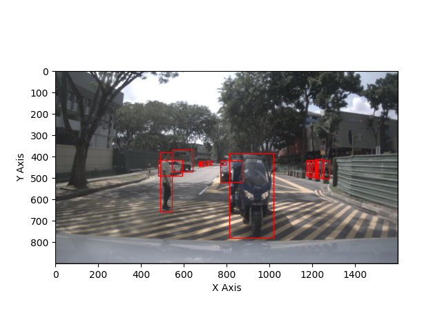
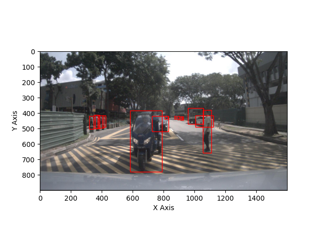
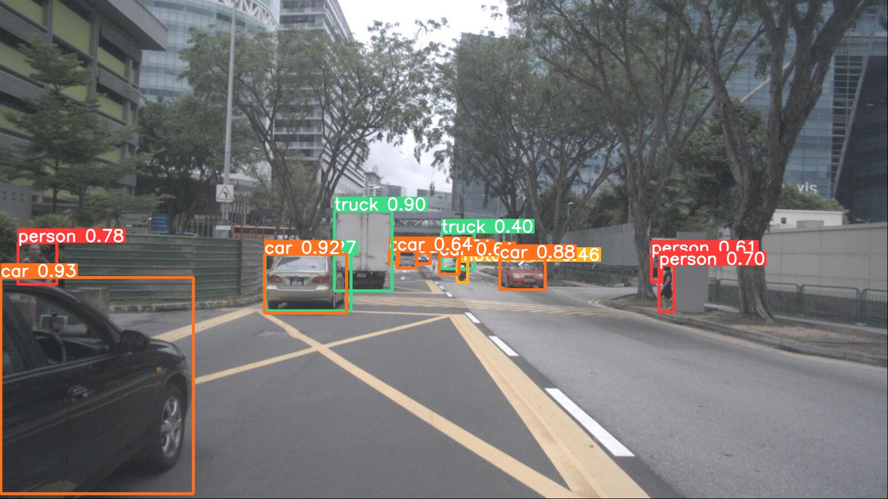
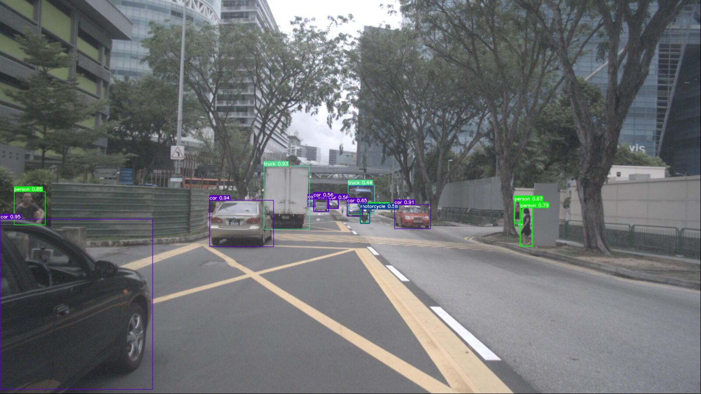
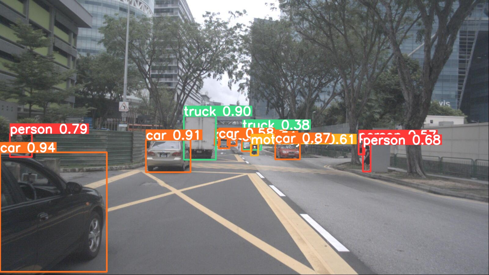
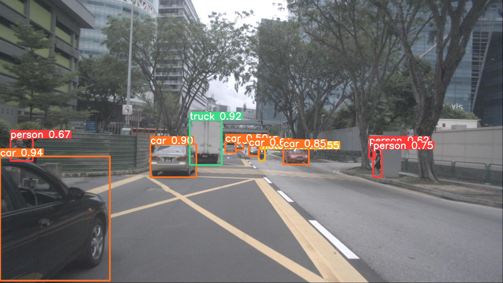

## Introduction
In this project, we propose an approach for data preprocessing based on nuImages database.

## Installation
1. Environment requirements

* Ubuntu 20.04
* Python 3.8
* Pytorch 2.1.2
* CUDA 12.1

The following installation guild suppose ``Ubuntu=20.04`` ``python=3.8`` ``pytorch=2.1.2`` and ``cuda=12.1``. You may change them according to your system, but linux is mandatory.

1. Create a conda virtual environment and activate it.
```
conda create -n nuimages python=3.8
conda activate nuimages
```

2. Clone the repository.
```
git clone https://github.com/LuckyMax0722/nuImages.git
```

3. Install the pyTorch
```
conda install pytorch==2.1.2 torchvision==0.16.2 torchaudio==2.1.2 pytorch-cuda=12.1 -c pytorch -c nvidia
```

4. Install the nuImages development kit
```
pip install nuscenes-devkit
```

For detail information, please refer to [nuImages
/nuscenes_devkit](https://github.com/LuckyMax0722/nuImages/blob/51132df94d060667b071b24f462db95cc29c0294/nuscenes_devkit/README.md)

5. Install MM development kit
```
pip install -U openmim
mim install mmengine
mim install mmcv
mim install mmdet
```
6. Install the dependencies.
```
pip install ultralytics
pip install easydict
pip install notebook
pip install tensorboard
pip install pandas
pip install seaborn thop
```

7. yolo2coco
```
pip install pylabel
```

## Data Preparation
1. First, you need to register/login on nuScenes to download the [nuImages dataset](https://www.nuscenes.org/nuimages).
There are two nuImages datasets available on the nuScenes website, that is, **Mini** and **All**. you can choose to download either of them, but this work only develops the **Mini-based** data processing method. Your folder should look like this:
```
data
├── nuimages
│   ├── samples
│       ├── CAM_BACK     
│       ├── .......
│   ├── v1.0-mini
│       ├── ......
│   ├── v1.0-train (optional)
│       ├── ......
│   ├── ......
```

2. Before processing the data, please set the base path of the project in ``lib/config.py``.
```angular2html
# Main Path
...
CONF.PATH.BASE = '.../nuImages'  # TODO: change this
```

3. First you need to use a data converter to convert the nuImages dataset into a YOLO format dataset. Please note that this step is **mandatory** whether you want to use YOLO or not. This YOLO format dataset is available for YOLOv5-v9 (except v6).
```angular2html
python tools/nuImages2yolo.py
```
Your folder should look like this:
```
datasets_mini
├── nuImages
│   ├── images
│       ├── train     
│           ├── n003...8469.jpg
│           ├── ...
│       ├── val
│           ├── n013...5896.jpg
│           ├── ...
│   ├── labels
│       ├── train     
│           ├── n003...8469.txt
│           ├── ...
│       ├── val
│           ├── n013...5896.txt
│           ├── ...
```

## Data Augmentation
In addition to data augmentation in YOLO, this project provides additional ways to augment data.
```angular2html
python <../tools/augmentation.py>
```
### Horizontal Flip
<div style="display:inline-block">
  
  
</div>

## Data Conversion
### YOLOv6
If you want to use YOLOv6 for training and inference on the nuImages dataset, first set the model version in ``lib/config.py``.
```angular2html
# Model
CONF.model = EasyDict()
CONF.model.version = 'YOLOv6' # ['YOLOv6', 'DETR'] # TODO: change this
```
Then use the data conversion tool.
```angular2html
python tools/nuImages2yolo6.py
```
Your folder should look like this:
```
datasets_mini_yolov6
├── nuImages
│   ├── annotations
│       ├── instance_train2017.json
│       ├── instance_val2017.json
│   ├── images
│       ├── train2017    
│           ├── n003...8469.jpg
│           ├── ...
│       ├── val2017
│           ├── n013...5896.jpg
│           ├── ...
│   ├── labels
│       ├── train2017   
│           ├── n003...8469.txt
│           ├── ...
│       ├── val2017
│           ├── n013...5896.txt
│           ├── ...
```

### COCO
If you want to use DETR for training and inference on the nuImages dataset, first set the model version in ``lib/config.py``.
```angular2html
# Model
CONF.model = EasyDict()
CONF.model.version = 'DETR' # ['YOLOv6', 'DETR'] # TODO: change this
```
Then use the data conversion tool.
```angular2html
python tools/yolo2coco.py
```
Your folder should look like this:
```
datasets_mini_coco
├── nuImages
│   ├── annotations
│       ├── instance_train2017.json
│       ├── instance_val2017.json
│   ├── train2017    
│       ├── n003...8469.jpg
│       ├── ...
│   ├── val2017
│       ├── n013...5896.jpg
│       ├── ...
```

## Object Detection
Please use absolute path for the following command, for example, use ``/home/Max/nuImages/YOLOv6/tools/train.py`` instead of ``<../tools/train.py>``.
### One-Stage Multi-Object Detection
#### YOLOv5
For detail information, please refer to [YOLOv5](https://github.com/ultralytics/yolov5)

<p align="center"></p>

##### train
```angular2html
python3 <..train.py> --img-size 640 --batch-size 6 --epochs 100 --data <../data/nuImages_train.yaml> --cfg <..models/yolov5x_nuImages.yaml> --weights <../weights/yolov5x.pt>
```

##### inference
```angular2html
python <../detect.py> --weights <../yolov5x.pt> --data <../data/nuImages_inference.yaml> --source path_img/Video/...
```

#### YOLOv6
For detail information, please refer to [YOLOv6](https://github.com/meituan/YOLOv6)

<p align="center"></p>

##### train
```angular2html
python <../tools/train.py> --data-path <../data/nuImages_train.yaml> --batch-size 6 --conf-file <../configs/yolov6n.py> --output-dir <../runs/train>
```

##### evaluate
```angular2html
python <../tools/eval.py> --data <../data/nuImages_train.yaml> --batch 6 --weights <../weights/yolov6l.pt> --task val --reproduce_640_eval --eval_config_file <../configs/experiment/eval_640_repro.py>
```

##### inference
```angular2html
python <../tools/infer.py> --yaml <../data/nuImages_inference.yaml> --weights <../weights/yolov6l.pt> --save-dir <../runs/inference/exp> --source path_img/Video/...
```

#### YOLOv7
For detail information, please refer to [YOLOv7](https://github.com/WongKinYiu/yolov7)

<p align="center"></p>

```angular2html
python <../train.py> --workers 8 --device 0 --epochs 300 --batch-size 6 --data ./data/nuImages_train.yaml --img 640 640 --cfg <../cfg/training/yolov7x_nuImages.yaml> --weights <../weights/yolov7x.pt> --name yolov7x --hyp <../data/hyp.scratch.p5.yaml>
```

##### inference
```angular2html
python <../detect.py> --weights <../yolov7x.pt> --iou-thres 0.9 --img-size 640 --source path_img/Video/... --project <../runs/inference>
```

#### YOLOv8
For detail information, please refer to [YOLOv8](https://github.com/ultralytics/ultralytics)

<p align="center"></p>

```angular2html
python <../train.py>
```

##### inference
```angular2html
python <../infer.py>
```

#### YOLOv9
For detail information, please refer to [YOLOv9](https://github.com/WongKinYiu/yolov9)

<p align="center"></p>

```angular2html
python <../train_dual.py> --workers 8 --device 0 --batch 4 --data <../data/nuimages.yaml> --img 640 --cfg <../models/detect/yolov9-e.yaml> --name yolov9-e --hyp hyp.scratch-high.yaml --min-items 0 --epochs 300 --close-mosaic 15
```

##### inference
```angular2html
python <../detect.py> --source path_img/Video/... --img 640 --device 0 --weights <../weights/yolov9-e-converted.pt>
```


### Transformer-based Multi-Object Detection
#### DETR
For detail information, please refer to [DETR](https://github.com/facebookresearch/detr?tab=readme-ov-file)

<p align="center"></p>

##### train
```angular2html
python <../main.py> --dataset_file coco --coco_path <../nuImages> --batch_size 4 --output_dir <../runs/train>
```

##### inference
```angular2html
python <../inference.py> --resume <../weights/detr-r50-e632da11.pth> --source_dir path_img/... --output_dir <../runs/inference>
```

