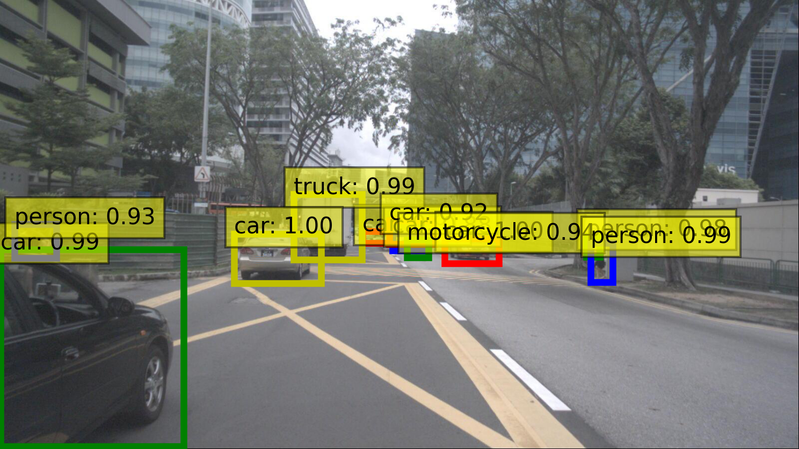

## Introduction
In this project, we propose an approach for data preprocessing based on nuImages database.

## Installation
1. Environment requirements

* Ubuntu 20.04
* Python 3.8
* Pytorch 2.1.2
* CUDA 12.1

The following installation guild suppose ``Ubuntu=20.04`` ``python=3.8`` ``pytorch=2.1.2`` and ``cuda=12.1``. You may change them according to your system, but linux is mandatory.

1. Create a conda virtual environment and activate it.
```
conda create -n nuimages python=3.8
conda activate nuimages
```

2. Clone the repository.
```
git clone https://github.com/LuckyMax0722/nuImages.git
```

3. Install the pyTorch
```
conda install pytorch==2.1.2 torchvision==0.16.2 torchaudio==2.1.2 pytorch-cuda=12.1 -c pytorch -c nvidia
```

4. Install the nuImages development kit
```
pip install nuscenes-devkit
```

For detail information, please refer to [nuImages
/nuscenes_devkit](https://github.com/LuckyMax0722/nuImages/blob/51132df94d060667b071b24f462db95cc29c0294/nuscenes_devkit/README.md)

5. Install MM development kit
```
pip install -U openmim
mim install mmengine
mim install mmcv
mim install mmdet
```
6. Install the dependencies.
```
pip install ultralytics
pip install easydict
pip install notebook
pip install tensorboard
pip install pandas
pip install seaborn thop
```

7. yolo2coco
```
pip install pylabel
```

## Data Preparation

## Tasks
Please use absolute path for the following command, for example, use ``/home/Max/nuImages/YOLOv6/tools/train.py`` instead of ``<../tools/train.py>``.
### One-Stage Multi-Object Detection
#### YOLOv5
For detail information, please refer to [YOLOv5](https://github.com/ultralytics/yolov5)

<p align="center"></p>

##### train
```angular2html
python3 <..train.py> --img-size 640 --batch-size 6 --epochs 100 --data <../data/nuImages_train.yaml> --cfg <..models/yolov5x_nuImages.yaml> --weights <../weights/yolov5x.pt>
```

##### inference
```angular2html
python <../detect.py> --weights <../yolov5x.pt> --data <../data/nuImages_inference.yaml> --source path_img/Video/...
```

#### YOLOv6
For detail information, please refer to [YOLOv6](https://github.com/meituan/YOLOv6)

<p align="center"></p>

##### train
```angular2html
python <../tools/train.py> --data-path <../data/nuImages_train.yaml> --batch-size 6 --conf-file <../configs/yolov6n.py> --output-dir <../runs/train>
```

##### evaluate
```angular2html
python <../tools/eval.py> --data <../data/nuImages_train.yaml> --batch 6 --weights <../weights/yolov6l.pt> --task val --reproduce_640_eval --eval_config_file <../configs/experiment/eval_640_repro.py>
```

##### inference
```angular2html
python <../tools/infer.py> --yaml <../data/nuImages_inference.yaml> --weights <../weights/yolov6l.pt> --save-dir <../runs/inference/exp> --source path_img/Video/...
```

#### YOLOv7
```
cd ./nuImages/YOLOv7
python train.py --workers 8 --device 0 --epochs 30 --batch-size 6 --data ./data/nuImages.yaml --img 640 640 --cfg ./cfg/training/yolov7x_nuImages.yaml --weights ./weights/yolov7x.pt --name yolov7x --hyp ./data/hyp.scratch.p5.yaml
```

### Transformer-based Multi-Object Detection
#### DETR
For detail information, please refer to [DETR](https://github.com/facebookresearch/detr?tab=readme-ov-file)

<p align="center"></p>

##### train
```angular2html
python <../main.py> --dataset_file coco --coco_path <../nuImages> --batch_size 4 --output_dir <../runs/train>
```

##### inference
```angular2html
python <../inference.py> --resume <../weights/detr-r50-e632da11.pth> --source_dir path_img/... --output_dir <../runs/inference>
```

